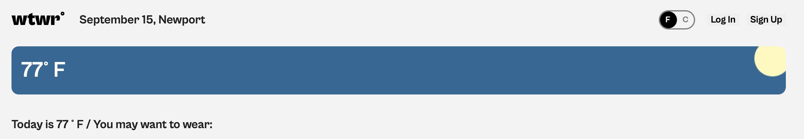
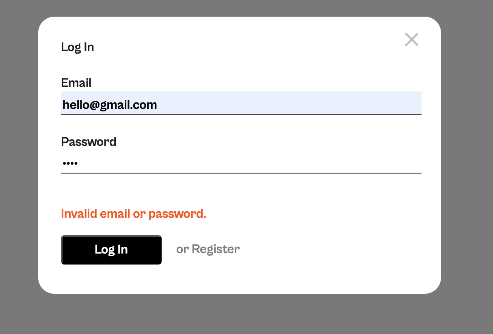

# WTWR (What to Wear?): Frontend Description

This is a weather-based clothing recommendation app featuring user authentication, profile management, and the ability to add, like, and manage clothing items.

## Technologies Used

- React
- CSS Modules
- React Router
- API Integration
- Authentication
- State Management (local state, Context API)

## Key Features

- User authentication with registration and login validation
- Dynamic modal forms for various user actions
- Add, edit, and delete clothing items
- Custom weather-based API integration
- Live form validation and state handling
- Conditional rendering based on authentication status

## Challenges I Faced

One of the most challenging aspects of this project was implementing the sign-in and registration authentication flow. Managing user input, handling asynchronous requests to the backend, storing and validating JWT tokens, and conditionally rendering components based on the user's logged-in state required careful planning.

Through this process, I learned how to structure authentication logic cleanly, persist user sessions using localStorage, and debug common errors like 400 and 404 status codes. These challenges helped strengthen my problem-solving skills and gave me a deeper understanding of secure frontend-backend communication.
## Improvements for the future 
To build upon this website, users can make their profiles public or private. For public profiles, users can follow each others closets and get inspiration for clothing items. Clothing brands could take advantage of this and link their clothes, so users could go straight to the brands website and buy a clothing item they are interested in.
## Screenshots

The implementation of the weather API, with option to toggle between F and C. 
 

Example of validation 

## Development Stack Info

This project uses [Vite](https://vitejs.dev/) for fast frontend development and hot module replacement (HMR). It also includes:

- [`@vitejs/plugin-react`](https://github.com/vitejs/vite-plugin-react): Uses Babel for fast refresh during development.

## Deployment Links

- **Backend GitHub Repository:** [https://github.com/adelapaz33/se_project_express](https://github.com/adelapaz33/se_project_express)

- **Deployed Domains** (available until September 2025):
  - **Frontend:** [https://ttwtwr.twilightparadox.com](https://ttwtwr.twilightparadox.com)
  - **Backend (API):** [https://api.ttwtwr.twilightparadox.com](https://api.ttwtwr.twilightparadox.com)

## Demo Link

[Demo Link](https://youtu.be/eGQR6fo5mP8?si=lz8z-w8bTv15gDT5)